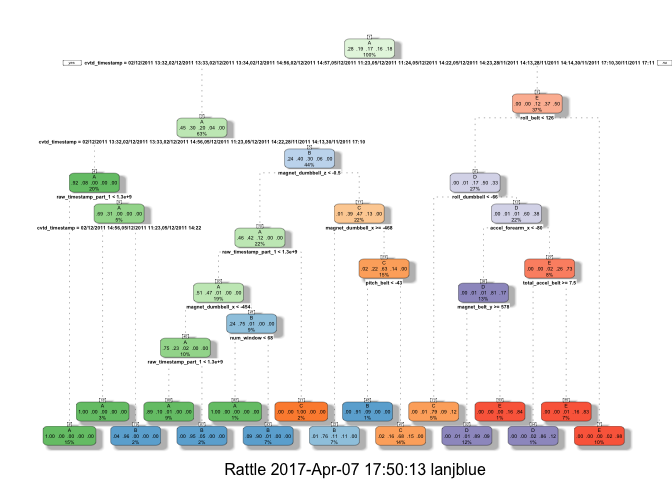

Title: Machine Learning Course Project
======================================

Background inforamtion:
-----------------------

Six participants wearing accelerometers on their belt, forearm, arm, and
dumbell were asked to perform barbell lifts correctly and incorrectly in
5 different ways. Our goal is to predict the manner in which they did
the exercise. Both training and testing data sets are from the website:
<http://groupware.les.inf.puc-rio.br/har>

Load library
------------

    FALSE 
    FALSE Attaching package: 'dplyr'

    FALSE The following objects are masked from 'package:stats':
    FALSE 
    FALSE     filter, lag

    FALSE The following objects are masked from 'package:base':
    FALSE 
    FALSE     intersect, setdiff, setequal, union

    FALSE Loading required package: lattice

    FALSE Loading required package: ggplot2

    FALSE Rattle: A free graphical interface for data mining with R.
    FALSE Version 4.1.0 Copyright (c) 2006-2015 Togaware Pty Ltd.
    FALSE Type 'rattle()' to shake, rattle, and roll your data.

    FALSE -------------------------------------------------------------------------

    FALSE data.table + dplyr code now lives in dtplyr.
    FALSE Please library(dtplyr)!

    FALSE -------------------------------------------------------------------------

    FALSE 
    FALSE Attaching package: 'data.table'

    FALSE The following objects are masked from 'package:dplyr':
    FALSE 
    FALSE     between, first, last

Data source
-----------

    url <- "https://d396qusza40orc.cloudfront.net/predmachlearn/pml-training.csv"
    training <- fread(url)

    url <- "https://d396qusza40orc.cloudfront.net/predmachlearn/pml-testing.csv"
    testing <- fread(url)

Data cleaning.
--------------

Remove variables with all missing values. Remove ID varaibles.

    isAnyMissing <- sapply(training, function (x) any(is.na(x) | x == ""))
    keepVariable <- names(isAnyMissing)[!isAnyMissing]
    keepVariable <- keepVariable[-c(1,2)]

### subset primary dataset with only related varialbes and outcome varialbe classe.

    trainSet <- select_(training, .dots = keepVariable)
    testSet <- select_(testing, .dots = keepVariable[-58])

Create training and testing
---------------------------

    set.seed(1234)
    inTrain = createDataPartition(trainSet$classe, p = 0.6)[[1]]
    myTraining = trainSet[ inTrain,]
    myTesting = trainSet[-inTrain,]

Building models
---------------

### Method: random forest

    set.seed(1234)
    controlRF <- trainControl(method="cv", number=3, verboseIter=FALSE)
    modelRF <- train(classe ~ ., data=myTraining, method="rf", trControl=controlRF)

    ## Loading required package: randomForest

    ## randomForest 4.6-12

    ## Type rfNews() to see new features/changes/bug fixes.

    ## 
    ## Attaching package: 'randomForest'

    ## The following object is masked from 'package:ggplot2':
    ## 
    ##     margin

    ## The following object is masked from 'package:dplyr':
    ## 
    ##     combine

    modelRF$finalModel

    ## 
    ## Call:
    ##  randomForest(x = x, y = y, mtry = param$mtry) 
    ##                Type of random forest: classification
    ##                      Number of trees: 500
    ## No. of variables tried at each split: 38
    ## 
    ##         OOB estimate of  error rate: 0.17%
    ## Confusion matrix:
    ##      A    B    C    D    E  class.error
    ## A 3348    0    0    0    0 0.0000000000
    ## B    4 2273    2    0    0 0.0026327337
    ## C    0    3 2047    4    0 0.0034079844
    ## D    0    0    3 1925    2 0.0025906736
    ## E    0    0    0    2 2163 0.0009237875

    predictRF <- predict(modelRF, newdata=myTesting)
    confMatRF<- confusionMatrix(predictRF, myTesting$classe)
    confMatRF

    ## Confusion Matrix and Statistics
    ## 
    ##           Reference
    ## Prediction    A    B    C    D    E
    ##          A 2232    2    0    0    0
    ##          B    0 1516    1    0    0
    ##          C    0    0 1367    3    0
    ##          D    0    0    0 1283    0
    ##          E    0    0    0    0 1442
    ## 
    ## Overall Statistics
    ##                                           
    ##                Accuracy : 0.9992          
    ##                  95% CI : (0.9983, 0.9997)
    ##     No Information Rate : 0.2845          
    ##     P-Value [Acc > NIR] : < 2.2e-16       
    ##                                           
    ##                   Kappa : 0.999           
    ##  Mcnemar's Test P-Value : NA              
    ## 
    ## Statistics by Class:
    ## 
    ##                      Class: A Class: B Class: C Class: D Class: E
    ## Sensitivity            1.0000   0.9987   0.9993   0.9977   1.0000
    ## Specificity            0.9996   0.9998   0.9995   1.0000   1.0000
    ## Pos Pred Value         0.9991   0.9993   0.9978   1.0000   1.0000
    ## Neg Pred Value         1.0000   0.9997   0.9998   0.9995   1.0000
    ## Prevalence             0.2845   0.1935   0.1744   0.1639   0.1838
    ## Detection Rate         0.2845   0.1932   0.1742   0.1635   0.1838
    ## Detection Prevalence   0.2847   0.1933   0.1746   0.1635   0.1838
    ## Balanced Accuracy      0.9998   0.9993   0.9994   0.9988   1.0000

### Method: Decision Trees

    set.seed(1234)
    modelDT <- rpart(classe ~ ., data=myTraining, method="class")
    fancyRpartPlot(modelDT)

    predictDT <- predict(modelDT, newdata=myTesting, type="class")
    confMatDT <- confusionMatrix(predictDT, myTesting$classe)
    confMatDT

    ## Confusion Matrix and Statistics
    ## 
    ##           Reference
    ## Prediction    A    B    C    D    E
    ##          A 2161   61    5    3    0
    ##          B   50 1271   95   64    0
    ##          C   21  177 1242  203   65
    ##          D    0    9   19  899   92
    ##          E    0    0    7  117 1285
    ## 
    ## Overall Statistics
    ##                                           
    ##                Accuracy : 0.8741          
    ##                  95% CI : (0.8665, 0.8813)
    ##     No Information Rate : 0.2845          
    ##     P-Value [Acc > NIR] : < 2.2e-16       
    ##                                           
    ##                   Kappa : 0.8407          
    ##  Mcnemar's Test P-Value : NA              
    ## 
    ## Statistics by Class:
    ## 
    ##                      Class: A Class: B Class: C Class: D Class: E
    ## Sensitivity            0.9682   0.8373   0.9079   0.6991   0.8911
    ## Specificity            0.9877   0.9670   0.9281   0.9817   0.9806
    ## Pos Pred Value         0.9691   0.8588   0.7272   0.8822   0.9120
    ## Neg Pred Value         0.9874   0.9612   0.9795   0.9433   0.9756
    ## Prevalence             0.2845   0.1935   0.1744   0.1639   0.1838
    ## Detection Rate         0.2754   0.1620   0.1583   0.1146   0.1638
    ## Detection Prevalence   0.2842   0.1886   0.2177   0.1299   0.1796
    ## Balanced Accuracy      0.9779   0.9021   0.9180   0.8404   0.9359

### Method: Generalized Boosted Model

    set.seed(1234)
    controlGBM <- trainControl(method = "repeatedcv", number = 5, repeats = 1)
    modelGBM  <- train(classe ~ ., data=myTraining, method = "gbm",
                        trControl = controlGBM, verbose = FALSE)

    ## Loading required package: gbm

    ## Loading required package: survival

    ## 
    ## Attaching package: 'survival'

    ## The following object is masked from 'package:caret':
    ## 
    ##     cluster

    ## Loading required package: splines

    ## Loading required package: parallel

    ## Loaded gbm 2.1.3

    ## Loading required package: plyr

    ## -------------------------------------------------------------------------

    ## You have loaded plyr after dplyr - this is likely to cause problems.
    ## If you need functions from both plyr and dplyr, please load plyr first, then dplyr:
    ## library(plyr); library(dplyr)

    ## -------------------------------------------------------------------------

    ## 
    ## Attaching package: 'plyr'

    ## The following objects are masked from 'package:dplyr':
    ## 
    ##     arrange, count, desc, failwith, id, mutate, rename, summarise,
    ##     summarize

    modelGBM$finalModel

    ## A gradient boosted model with multinomial loss function.
    ## 150 iterations were performed.
    ## There were 75 predictors of which 45 had non-zero influence.

    predictGBM <- predict(modelGBM, newdata=myTesting)
    confMatGBM <- confusionMatrix(predictGBM, myTesting$classe)
    confMatGBM

    ## Confusion Matrix and Statistics
    ## 
    ##           Reference
    ## Prediction    A    B    C    D    E
    ##          A 2232    3    0    0    0
    ##          B    0 1511    4    0    0
    ##          C    0    4 1351    7    0
    ##          D    0    0   13 1275    2
    ##          E    0    0    0    4 1440
    ## 
    ## Overall Statistics
    ##                                           
    ##                Accuracy : 0.9953          
    ##                  95% CI : (0.9935, 0.9967)
    ##     No Information Rate : 0.2845          
    ##     P-Value [Acc > NIR] : < 2.2e-16       
    ##                                           
    ##                   Kappa : 0.994           
    ##  Mcnemar's Test P-Value : NA              
    ## 
    ## Statistics by Class:
    ## 
    ##                      Class: A Class: B Class: C Class: D Class: E
    ## Sensitivity            1.0000   0.9954   0.9876   0.9914   0.9986
    ## Specificity            0.9995   0.9994   0.9983   0.9977   0.9994
    ## Pos Pred Value         0.9987   0.9974   0.9919   0.9884   0.9972
    ## Neg Pred Value         1.0000   0.9989   0.9974   0.9983   0.9997
    ## Prevalence             0.2845   0.1935   0.1744   0.1639   0.1838
    ## Detection Rate         0.2845   0.1926   0.1722   0.1625   0.1835
    ## Detection Prevalence   0.2849   0.1931   0.1736   0.1644   0.1840
    ## Balanced Accuracy      0.9997   0.9974   0.9929   0.9946   0.9990

### Which model is more accurate

Comparing the three modesl used here: random forest, decision tree and
generalized boosted model, we can see that random forest yield better
accuracy. Thus we will use it to further predict our testing set.

    confMatRF$overall[1]

    ##  Accuracy 
    ## 0.9992353

    confMatDT$overall[1]

    ## Accuracy 
    ## 0.874076

    confMatGBM$overall[1]

    ##  Accuracy 
    ## 0.9952842

Making Test Set Predictions.
----------------------------

    predictTEST <- predict(modelRF, newdata=testing)
    predictTEST

    ##  [1] B A B A A E D B A A B C B A E E A B B B
    ## Levels: A B C D E
